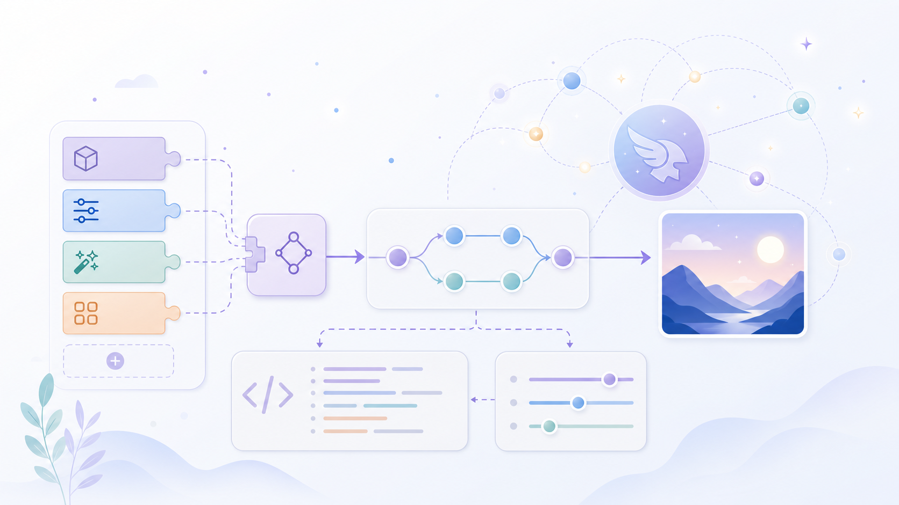

# Hermes OpenAI-Compatible Image Provider

A Hermes `image_gen` backend for services that expose an OpenAI-compatible `POST /v1/images/generations` API. It supports Hermes `providers:` reuse, custom-provider aliases like `custom:my_image_api`, named presets, retries, URL or base64 outputs, and local cache storage.

## Install

Recommended interactive install:

```bash
curl -fsSL https://raw.githubusercontent.com/tickernelz/hermes-openai-compatible-image/v0.2.2/install.sh | bash
```

The TUI handles the whole setup:

- choose target Hermes profile(s)
- choose an existing Hermes provider/custom provider when available
- or enter a new OpenAI-compatible endpoint
- fetch model choices from Hermes inventory and/or `GET /v1/models`
- prompt API keys as password input
- write profile `.env`
- update `config.yaml`
- copy the plugin into the selected profile(s)

Dry-run through the same TUI:

```bash
curl -fsSL https://raw.githubusercontent.com/tickernelz/hermes-openai-compatible-image/v0.2.2/install.sh | bash -s -- --dry-run
```

Noninteractive / CI install for a known existing Hermes provider:

```bash
curl -fsSL https://raw.githubusercontent.com/tickernelz/hermes-openai-compatible-image/v0.2.2/install.sh | bash -s -- \
  --yes --all-profiles \
  --custom-provider my_image_api \
  --model provider/image-model
```

New endpoint with API key written to each selected profile `.env`:

```bash
curl -fsSL https://raw.githubusercontent.com/tickernelz/hermes-openai-compatible-image/v0.2.2/install.sh | bash -s -- \
  --yes --profile default,work \
  --custom-provider my_image_api \
  --base-url https://provider.example/v1 \
  --api-key-env MY_IMAGE_API_KEY \
  --api-key 'sk-...' \
  --model provider/image-model
```

The shell wrapper auto-detects Hermes paths before launching the Python installer:

- `--hermes-home` / `HERMES_HOME` still win when supplied.
- Otherwise it asks `hermes config path` from the detected `hermes` launcher to find the profile base.
- It separates the profile home from the Hermes runtime Python, inferring Python from `HERMES_BIN`, `$PATH`, small shell launchers that `exec` the real Hermes venv, or `$HERMES_HOME/hermes-agent/venv/bin/python`.
- `--hermes-bin`, `HERMES_BIN`, or `$PATH` can point at the Hermes launcher.
- `--hermes-python`, `HOII_HERMES_PYTHON`, or `HERMES_PYTHON` can override runtime Python explicitly.
- Interactive installer dependencies (`PyYAML`, `Rich`, `prompt_toolkit`) are installed into a temporary isolated installer venv, not into Hermes' runtime venv, so Hermes dependency pins stay untouched.

Restart Hermes CLI/gateway sessions after install so the plugin registry reloads.

For unreleased main:

```bash
curl -fsSL https://raw.githubusercontent.com/tickernelz/hermes-openai-compatible-image/main/install.sh | HOII_REF=main bash
```

## Config shape

The installer writes this for you. Example output when reusing a Hermes provider:

```yaml
plugins:
  enabled:
    - image_gen/openai-compatible-image

image_gen:
  provider: custom:my_image_api
  preset: auto
  openai_compatible_image:
    custom_provider: my_image_api
    api_key_env: MY_IMAGE_API_KEY
    presets:
      auto:
        model: provider/image-model
        sizes:
          landscape: 1536x1024
          portrait: 1024x1536
          square: 1024x1024

providers:
  my_image_api:
    api: https://provider.example/v1
    key_env: MY_IMAGE_API_KEY
```

And `.env` gets the secret:

```env
MY_IMAGE_API_KEY=<redacted>
```

## Features

- Guided TUI installer with Rich + prompt_toolkit.
- Registers `openai-compatible-image` plus configured custom aliases (`custom:<name>` and `<name>`).
- Resolves credentials from env overrides, profile `.env`, `api_key_env`, `providers:`, legacy `custom_providers:`, or direct image config.
- Installer can write API keys into profile `.env` so users do not need a second manual edit step.
- Model picker uses Hermes inventory when available and probes `GET /v1/models` when endpoint credentials exist.
- Supports `b64_json`, data-URL base64, and URL responses; URL outputs are downloaded into Hermes cache.
- Preset-driven model/size/extra body config, including per-aspect `landscape`, `portrait`, and `square` routing.
- Retries transient HTTP `502/503/504` failures without retrying auth/client errors.
- Adds `/image_preset` for listing and switching presets globally or per session.

## Verify

```bash
python3 -m py_compile ~/.hermes/plugins/image_gen/openai-compatible-image/__init__.py
hermes chat -q 'Generate a tiny blue dot on a white background. Use image generation.' --toolsets image_gen --quiet
```

For a named profile:

```bash
hermes -p work chat -q 'Generate a tiny blue dot on a white background. Use image generation.' --toolsets image_gen --quiet
```

Generated images are saved under `$HERMES_HOME/cache/images/`.

## Local development

```bash
python -m pytest -q
python -m py_compile openai-compatible-image/__init__.py scripts/install.py
bash -n install.sh
git diff --check
```

See [`openai-compatible-image/config.example.yaml`](openai-compatible-image/config.example.yaml) for a fuller config fragment.
